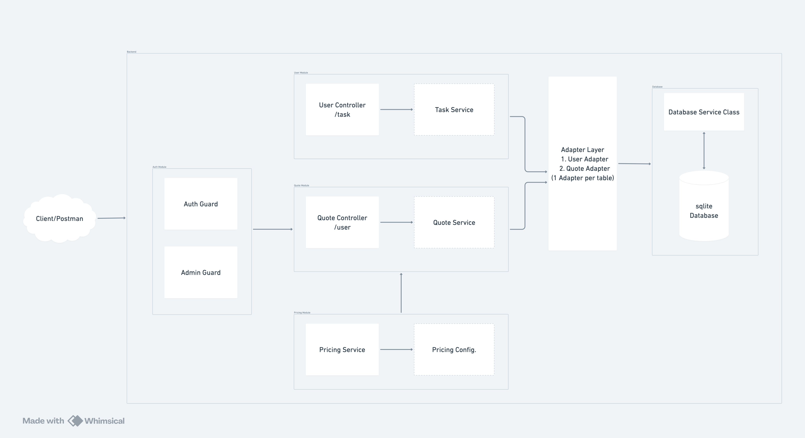

# green-quote

## Overview

GreenQuote is a full-stack solar financing pre-qualification platform. Users register, submit their installation address, monthly electricity consumption, desired system size, and an optional down payment. The backend computes the system price, assigns a risk band (A / B / C) based on usage and system size, and returns up to three loan offers (5, 10, and 15-year terms) with their respective APR and monthly instalments. Admins can browse all quotes across all users and filter by name or email.

---

## Technology Stack

- Backend – NestJS (TypeScript) with Prisma ORM and SQLite.
- Frontend – React with React Router (TypeScript).
- Infrastructure – Docker Compose with Aspire Dashboard for observability (traces, metrics, logs).

---

## Installation & Setup

Prerequisites: Node.js ≥ 20 and npm for local development, or Docker / Rancher Desktop for the containerised setup.

1. Clone the repository

```bash
git clone <repo-url>
cd green-quote
```

2. Docker - start everything from the repo root

> Make sure Docker or Rancher Desktop is running first.

```bash
docker compose up --build
```

This single command builds and starts all three services - the NestJS API server, the React client, and the Aspire Dashboard.

---

## Endpoints

- Client - `http://localhost:5173`
- Server - `http://localhost:3000`
- Docs - `http://localhost:3000/api/docs`
- Health - `http://localhost:3000/api/health`
- Aspire Dashboard - `http://localhost:18888`

---

## Admin Access

The database is seeded with an admin account on first run — email `admin@test.com`, password `testadmin`.

Admins have the same quote creation flow as regular users plus an additional **Admin — All Quotes** view that lists every quote across all users.

**Filtering:** The admin view supports filtering quotes by user full name or email. A minimum of 3 characters is required to trigger a search, with a 1-second debounce to avoid excessive API calls. Both `full_name` and `email` columns are indexed in the database for efficient lookups.

---

## Test

```bash
cd server
npm run test        # unit tests
```
---

## Architecture

### Overview



Three services orchestrated by Docker Compose:

1. NestJS API Server - auth, business logic, pricing computation, persistence.
2. React Router Client - SPA communicating with the API via JWT bearer tokens.
3. Aspire Dashboard - OpenTelemetry collector (gRPC `18889`) + real-time UI for traces, metrics, and logs.

### Architectural Decisions and Trade-offs

- Layered Architecture (Controller → Service → Adapter): Controllers handle HTTP concerns only. Services contain business logic. Adapters encapsulate all Prisma calls behind a generic `DatabaseService<T>` base. Services are easy to unit-test in isolation - mock the adapter, pass a real `PricingService`.

- Adapter Pattern over direct Prisma calls in services: `QuoteAdapter` and `UserAdapter` extend a shared `DatabaseService<T>` base with typed `findOne`, `findMany`, `insertEntry`, etc. Single seam to swap the ORM or database without touching service logic.

- Role encoded in JWT payload: `isAdmin` in the token means no extra DB round-trip per request. Trade-off: revoking admin rights requires a short TTL or a token denylist.

- Offers stored as serialised JSON: Computed at creation and persisted as a JSON string - no re-computation on reads. Changing the pricing formula does not retroactively update existing quotes, which is the correct behaviour for a pre-qualification product.

- OpenTelemetry: Full traces, metrics, and structured logs via OTLP to the Aspire Dashboard - performance regressions and errors are visible during development without a heavy observability stack.

---

## Things to Improve / Next Steps

- Separate admin login flow - admin is currently a flag on the regular user; a production system would have a distinct auth path.
- Pagination - `GET /quotes` and `GET /quotes/admin/all` return all records; cursor or offset pagination is needed at scale.
- Replace `fetch` with Axios - interceptors, automatic retries, and exponential backoff with minimal boilerplate.
- Protect the Aspire Dashboard - currently open to anonymous access; should be behind authentication in any shared environment.
- Expand test coverage - add integration tests (real SQLite) and end-to-end tests (Supertest API flows).
- CI pipeline - GitHub Actions with stages: format → lint → type-check → test → build.
- Rate limiting - per-IP or per-user limits to prevent API abuse.
- Monorepo for shared types - shared `packages/types` (e.g. pnpm workspaces) to avoid duplicating `QuoteResult`, `AuthTokenResponse`, etc. across server and client.

---

## Project Structure

```
green-quote/
├── docker-compose.yml          # Root compose - includes server & client compose files
├── Architecture.png
│
├── server/                     # NestJS API
│   ├── prisma/
│   │   ├── schema.prisma       # Database schema (User, Quote)
│   │   ├── seed.ts             # Seeds admin@test.com
│   │   └── migrations/
│   ├── src/
│   │   ├── main.ts             # Bootstrap: Swagger, Helmet, CORS, global pipes
│   │   ├── instrumentation.ts  # OpenTelemetry SDK setup
│   │   ├── app.module.ts       # Root module (JWT, Pino logger)
│   │   ├── app.controller.ts   # GET /api/health
│   │   ├── prisma.service.ts   # Prisma client singleton
│   │   ├── auth/               # JWT guard, admin guard, decorators
│   │   ├── adapters/           # QuoteAdapter, UserAdapter (database layer)
│   │   ├── database/           # Generic DatabaseService<T> base class
│   │   ├── user/
│   │   │   ├── controllers/    # POST /signup, POST /login
│   │   │   ├── services/       # Signup (bcrypt hash), login (JWT sign)
│   │   │   └── dto/            # SignupDto, LoginDto
│   │   ├── quote/
│   │   │   ├── controllers/    # POST /quotes, GET /quotes, GET /quotes/:id, GET /quotes/admin/all
│   │   │   ├── services/       # Quote creation, retrieval, access control
│   │   │   └── dto/            # CreateQuoteDto
│   │   ├── pricing/
│   │   │   ├── pricing.config.ts   # Constants: pricePerKw, band thresholds, APRs, terms
│   │   │   └── pricing.service.ts  # computeSystemPrice, computeRiskBand, computeOffers
│   │   └── utils/
│   │       └── env.ts          # Validated environment variables
│   ├── docker-compose.yml      # Server + Aspire Dashboard services
│   └── .env.example
│
└── client/                     # React Router v7 SPA
    ├── app/
    │   ├── root.tsx            # App shell, i18n provider
    │   ├── routes/
    │   │   ├── home.tsx        # Redirect to /quotes if logged in
    │   │   ├── login/          # Login form
    │   │   ├── signup/         # Sign-up form
    │   │   ├── quotes/         # User's quote list
    │   │   ├── quotes-new/     # New quote form
    │   │   ├── quotes-id/      # Quote detail with offers breakdown
    │   │   └── admin-quotes/   # Admin view - all quotes with user search
    │   ├── api.ts              # Typed fetch wrappers for all API calls
    │   └── utils/auth.ts       # JWT decode, isLoggedIn, getPayload
    ├── docker-compose.yml      # Client service
    └── .env.example
```